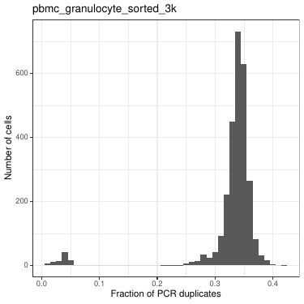
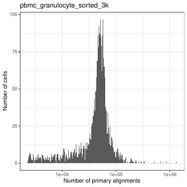
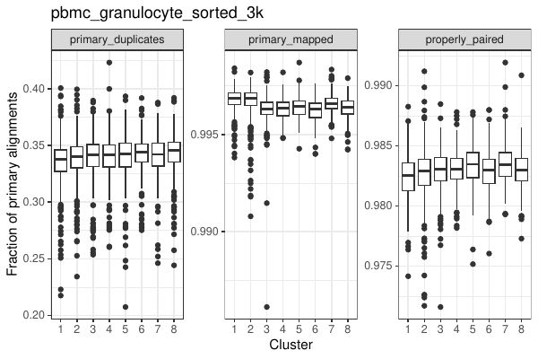
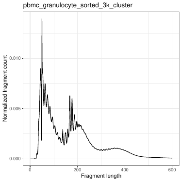
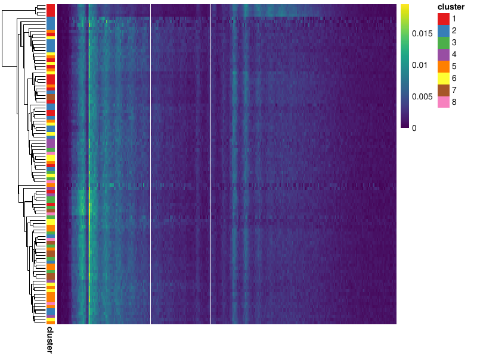
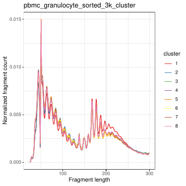
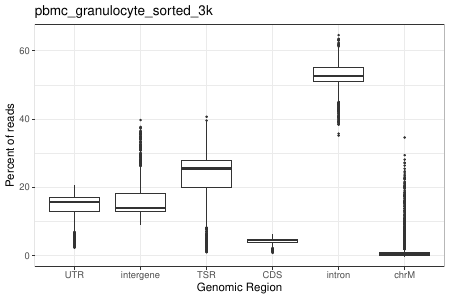
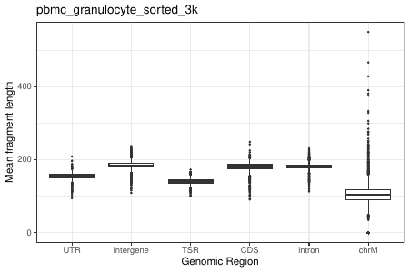
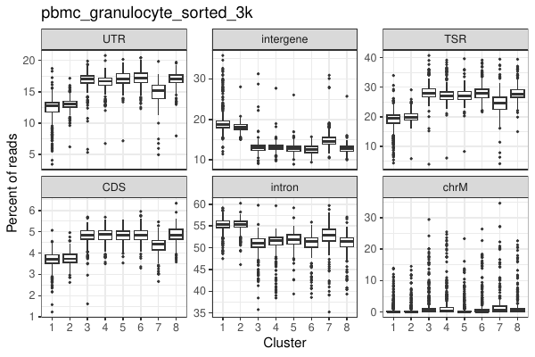
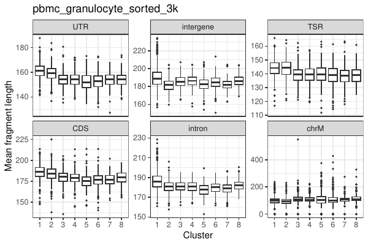

# Quality control of single-cell ATAC-seq datasets
We can compute several per-cell quality control (QC) metrics after we
have generated the fragments file. These metrics give an overview of
the sequencing experiment and the data quality, and these metrics could
also be used for filter out low quality cells prior to any downstream
analysis. 

All the QC metrics below are computed for each cell, and they can be
visualized across all cell in a sample as a first step prior to any
analysis. Though, these metrics could also be useful after the user as
clustered and/or annotated the data where the metrics can be stratified by
the cluster ID that is useful for comparing differences between clusters. 

## Alignment statistics
`samtools flagstat` is extremely useful to get alignment statistics
such as the number of aligned reads, number of PCR duplicates, etc. from
a sam/bam file. `bc_flagstat` is used to give almost the same information as
`flagstat` at a single cell level:

```
bc_flagstat -a {sample}_bc_match.bam -b {sample}_bc_counts.txt 
  -o {sample}
```

The helper scripts can then be used to generate the plots:
```
~/code/genomics/its_a_scam/scripts/atacFlagstat.R -f {sample}_bc_flagstat.txt 
  -c {cluster_id.tsv} -o {sample}
```

Where `-c {cluster_id.tsv}` is an optional parameter with the cluster
identity for each cell. This this file is provided, additional plots
with cell split by clusters are generated. 

The number of alignments per cell:

 

The fraction of PCR duplicates per cell:



When the cluster ID is provides, these are also plotted per cluster:



## Fragment length distribution
ATAC-seq data generates the characteristic fragment length distribution
that contains peaks corresponding to nucleosome-free, mono-nucleosome,
and multi-nucleosome bound fragments. We can similarly visualize the the
fragment length distribution at a single-cell level:
```
bc_frag_dist -a {sample}_bc_match.bam -b {sample}_bc_counts.txt 
  -q 30 -o {sample}
``` 

We can them use the helper scripts for visualization:
```
atacFragLength.R -f {sample}_bc_frag_len.txt -s {sample}_sample_frag_len.txt 
  -c {cluster_id.tsv} -o {sample}
```

The bulk fragment length distribution across all cells:

 

The fragment lengths distributions are plotted for each cell. The x-axis
is the fragment length, it starts at 25bp at the left end and 300bp at
the right end.  They are not shown for clarity. When the cluster ID id
is provided, it annotates the heatmap with the ID. 

 

Also, when the cluster ID is provides, the pseudo-bulked fragment
lengths for all cells in a clusters are also plotted:

 


## Aligned genomic regions
In an ATAC-seq experiment, we would expect a lot reads to aligning to the
the open chromatin regions that are mostly located in TSS and gene body
regions. `bc_feature_matrix` is used to determine the fraction reads
aligned to different genomic regions at the single cell level:

```
bc_feature_matrix -a {sample}_bc_match.bam -b {sample}_bc_counts.txt 
  -g annotation.gtf -q 30 -o {sample} [-t tss_m1k.bed]
```

We can them use the helper scripts for visualization:

```
atacGenomicRegionStats.R -f {sample}_feature_counts.txt 
  -l {sample}_feature_frag_len.txt -c {cluster_id.tsv} -o {sample}
```

The fraction of reads aligned to distinct genomic regions for each cell:
 

The mean fragment lengths of the fragments aligned to these regions:
 

When the cluster ID is provided, these plots are also stratified by
clusters. 

 

 


## Transcription start site enrichment score

```
tss_enrichment -a {sample}_bc_match.bam -b {sample}_bc_counts.txt 
  -r tss_pm1k.bed -q 30 -o {sample}
```
