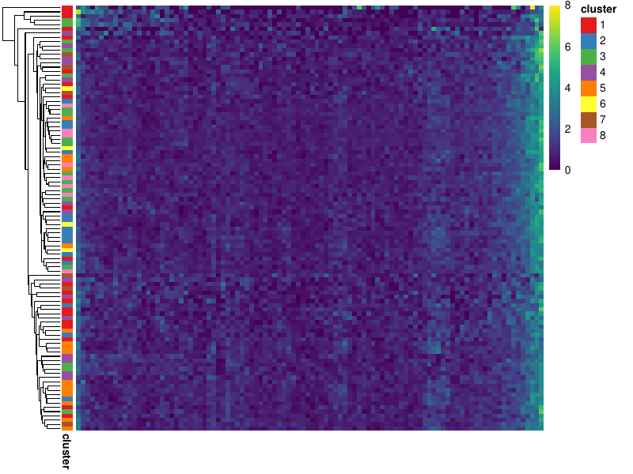

# Quality control of single-cell scRNAseq datasets
We can compute several per-cell quality control (QC) metrics after we
have generated the aligned sam/bam file. These metrics give an overview of
the sequencing experiment and the data quality, and these metrics could
also be used for filter out low quality cells prior to any downstream
analysis. 

All the QC metrics below are computed for each cell, and they can be
visualized across all cells in a sample as a first step prior to any
analysis. These metrics could also be useful after the user as
clustered and/or annotated the cells. The metrics can be stratified by
the cluster ID and are useful for comparing differences between clusters. 

## Aligned genomic regions
In an scRNA-seq experiment we would expect a lot reads aligning to the
exonic regions and, depending on the protocol, to the intronic regions.
`bc_gex_genomic_features` is used to determine the fraction of aligned bases 
to different genomic regions at the single cell level:

```
bc_gex_genomic_features -a {sample}.bam -b {barcodes}.tsv 
  -g {annotation}.gtf  -u UB -q 30 -F 2308 -o {sample}
```

We can them use the helper scripts for visualization:

```
gexGenomicRegionStats.R -f {sample}_feature_counts.txt 
  -c {cluster_id.tsv} -o sample
```

The fraction of bases to distinct genomic regions for each cell:

 

When the cluster ID is provided, these plots are also stratified by
clusters. 

 


## Genebody coverage 
Depending on the protocol used, we can expect the reads to be
generated from distinct regions on a transcript. For example, The 10x
3' protocol would generate reads from the 3' end of the transcript, the
10x 5' protocol from the 5' end, and the SMART-seq protocol would
generate reads from the whole transcript. `bc_genebody_coverage` is used
to determine the gene body coverage. The input genes/exons (typically
restricted to house keeping genes that are expected to expressed in all
cells) are converted to metagene regions and the fraction of reads
aligned along the gene body is computed for each cell.

```
bc_genebody_coverage -a {sample}.bam -b {barcodes}.tsv 
  -r {exon_regions}.bed  -u UB -v -q 30 -o {sample}
```

The `{exons_regions}.bed` is a bed file containing the exons regions of
the desired genes. These can be generated from the gtf file for all
protein coding genes as follows:

```
cat annotation.gtf | awk '{if($3=="exon"){print $0}}' | 
  grep protein_coding | 
  cut -f 1,4,5,7,9 | 
  sed -e 's/\.[0-9]*\";.*$//' | 
  sed -e 's/gene_id\ "//' | 
  awk '{print $1 "\t" $2-1 "\t" $3 "\t" $5 "\t.\t" $4}' > pc_exons.bed

cat pc_exons.bed | sort -k1,1 -k2,2n > pc_exons_sorted.bed

bedtools merge -i pc_exons_sorted.bed -s -c 4,5,6 
  -o distinct,distinct,distinct > pc_exons_sorted_merged.bed

cat pc_exons_sorted_merged.bed  | 
  grep -v , > | 
  sort -k1,1 -k4,4 -k2,2n > pc_exons_genebody.bed

rm pc_exons.bed pc_exons_sorted.bed pc_exons_sorted_merged.bed
```

If a specific set of genes are desired, the `pc_exons_genebody.bed` can
then be subset as desired.


We can then use the helper scripts for visualization:

```
gexGenebodyCoverage.R -g {sample}_genebody_coverage.txt 
  -c {cluster_id.txt} -o {sample}
```

The plot below shows the gene body coverage for each cell. The left
of the plot represents the 5' end and the right side is the 3' end (the
axis are not labeled on the plot for clarity). If the cluster ID is
provided the plot is also annotated with this ID. 

 

Also if the cluster ID is provided, the pseudo-bulked gene body
coverage over all cells in a cluster is also plotted. 

 
